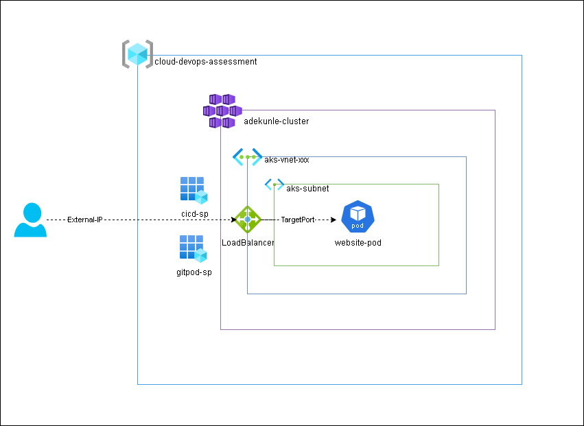

# Cloud DevOps Assessment Project



## Overview
This repository documents the process of deploying a static HTML website on Azure Kubernetes Service (AKS) as part of a Cloud DevOps Assessment project. My procedure involved setting up my development environment, creating Docker image, deploying Azure Kubernetes Service using Terraform, configuring Kubernetes manifests, and automating the build and deployment of my static website with GitHub Actions.

## Prerequisites
- An Azure account with active subscription
- GitHub account
- Docker Hub account
- Terraform Cloud account
- GitPod account/Any Linux environment

## Project Setup
### Development Environment Setup
I utilized GitPod Cloud Development Environment (CDE) for development and i installed necessary tools: kubectl, terraform and azure-cli.I also Authenticated into my Azure account using a service principal created for GitPod IDE.
```yaml
tasks:

  - name: terraform-and-kubectl-installation
    before: |
      source ./bin/install_terraform.sh
      source ./bin/set_terraform_cloud_token.sh
      source ./bin/install_kubectl.sh
      source ./bin/set_tf_alias.sh

  - name: azure-cli & docker login
    command: |
      sleep 60
      curl -sL https://aka.ms/InstallAzureCLIDeb | sudo bash
      source ./bin/set_tf_alias.sh
      az login --service-principal -u $IDE_CLIENT_ID -p $IDE_CLIENT_SECRET --tenant $IDE_TENANT_ID
      echo "$DOCKER_PASSWORD" | docker login --username "$DOCKER_USERNAME" --password-stdin
     
vscode:
  extensions:
    - hashicorp.terraform
```

### Terraform Cloud Configuration
I utilized Terraform Cloud to manage my terraform project and serving as my remote backend to maintain my statefile. I set up a workspace and added the configuration file to my providers.tf.

```h
terraform {

  cloud {
    organization = "ceeepath"

    workspaces {
      name = "perizer"
    }
  }
}
```

I also generated a token that my IDE uses to authenticate to Terraform Cloud and added it to `"/home/gitpod/.terraform.d/credentials.tfrc.json"`.

### Docker Image Creation
I created a Dockerfile to build the Docker image for the static website utilizing GitPod's existing Docker installation for image building. The Dockerfile was basically to install Apache and copy the website files into `/var/www/html` directory then expose the container on port 80.

### Infrastructure Deployment with Terraform
I developed a Terraform module to provision Azure Kubernetes Service (AKS). As a POC, i made use of a single node and disabled auto-scaling. A resource that outputs the config file needed to authenticate to and manage the kubernetes cluster from my IDE was also created. I then copied the file into the `'~/.kube'` directory.

### Kubernetes Manifests
I wrote a Pod manifest to host the website image on AKS and a service of type LoadBalancer was used to expose the website to the public via the External IP created by the Load Balancer.

### GitHub Actions Workflow
I configured a GitHub Actions workflow that is triggered on push events. This workflow runs on an Ubuntu server, clones the repository, installs and login to docker. It builds the image and pushes it to docker hub then it applies the pod and service manifest file to deploy the website on AKS using kubectl within the workflow.

### Challenges and Learning Experience
I encountered a few challenges during the course of this project, some due to my mistakes and some are technical ones that i did not envisage. However, i was able to find a solution to all the issues i encountered. Below are some of the issues i encountered;

- While Setting up my IDE and trying to install Terraform and Azure-cli, i got the error message below. I noticed the error was as a result of the multiple tasks running and there was a dependency lock so i had to add a `sleep 60` command to ensure the `terraform-and-kubectl-installation` task completes before the `azure-cli & docker login` begins execution. 

```bash
Could not get lock /var/lib/apt/lists/lock. It is held by process 520 (apt-get)
```

- It took me some time to figure out how to authenticate from GitPod to my Azure account. I created the service principal but didn't remember to set up RBAC and i kept geting error when i try to login. I finally resolved it by giving my Gitpod app a contributor role.

- I encountered some terraform issues while applying my configuration to deploy the Azure Kubernetes Service because the initial Kubernetes cluster version i selected was not present in the location i am deploying to. I had to run `az aks get-versions --location 'useast'` to find out which version i could make use of. Another issue i ran into was the use of `Standard_B1s` VM size. I learnt that the cluster requires VM sizes with at least 2 CPUs and 4GB of RAM.

- The most challenging issue i ran into was incorporating my kubeconfig file in my github runner. I had first thought to push the file to my repo and copy it to the `~/.kube` directory of the runner, but i received an email from **`GitGuardian`** about certificate exposure. SO i thought of using it as an environmental variable by storing it as a GitHub secret, but i kept getting errors in the pipeline. Finally, i searched the GitHub actions marketplace for "kubeconfig" and then i found the `Azure Kubernetes Service set context` action which can be used to set cluster context and allows kubectl commands to be run in the workflow.

Overall, the project provided valuable hands-on experience in cloud DevOps practices and enhanced skills in infrastructure automation, containerization, and CI/CD workflows.