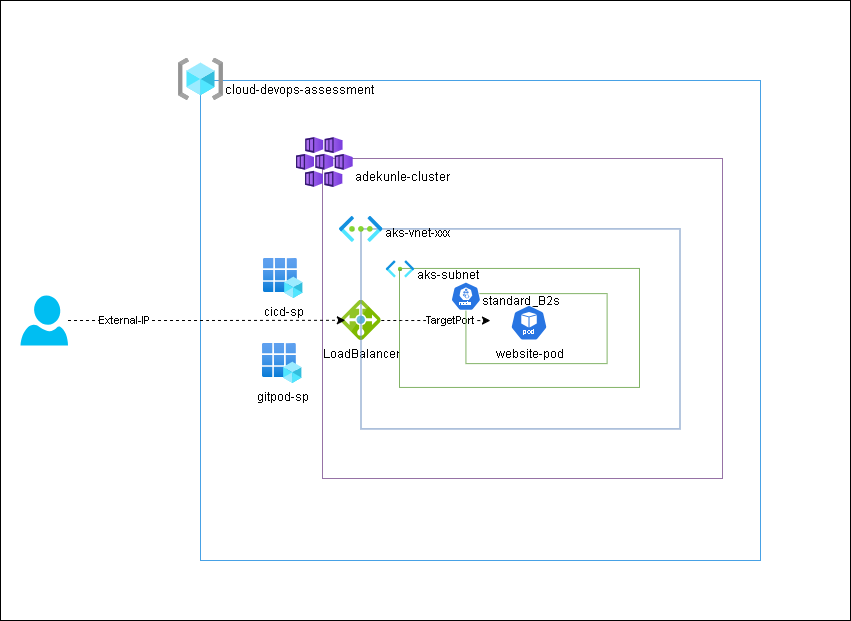

# Cloud DevOps Assessment Project



## Overview
This repository documents the process of deploying a static HTML website on Azure Kubernetes Service (AKS) as part of a Cloud DevOps Assessment project. The outlined procedure encompasses the setup of gitpod as a cloud development environment, creation of a Docker image, deployment of Azure Kubernetes Service utilizing Terraform, configuration of Kubernetes manifests, and implementation of automated build and deployment processes for the static website leveraging GitHub Actions.

## Prerequisites
- An Azure account with active subscription
- GitHub account
- Docker Hub account
- Terraform Cloud account
- GitPod account/Any Linux environment

## Project Setup
### Development Environment Setup
I leveraged GitPod Cloud Development Environment (CDE) to facilitate my development process, where I installed essential tools such as kubectl, Terraform, and Azure CLI. Furthermore, I authenticated into my Azure account utilizing a service principal specifically created for GitPod IDE integration.

```yaml
tasks:

  - name: terraform-and-kubectl-installation
    before: |
      source ./bin/install_terraform.sh
      source ./bin/set_terraform_cloud_token.sh
      source ./bin/install_kubectl.sh
      source ./bin/set_tf_alias.sh

  - name: azure-cli & docker login
    command: |
      sleep 60
      curl -sL https://aka.ms/InstallAzureCLIDeb | sudo bash
      source ./bin/set_tf_alias.sh
      az login --service-principal -u $IDE_CLIENT_ID -p $IDE_CLIENT_SECRET --tenant $IDE_TENANT_ID
      echo "$DOCKER_PASSWORD" | docker login --username "$DOCKER_USERNAME" --password-stdin
     
vscode:
  extensions:
    - hashicorp.terraform
```

### Terraform Cloud Configuration
I employed Terraform Cloud to oversee my Terraform project, leveraging it as the remote backend for maintaining my state file. I established a workspace and incorporated the configuration file into my providers.tf.

```h
terraform {

  cloud {
    organization = "ceeepath"

    workspaces {
      name = "perizer"
    }
  }
}
```

I also generated a token that my IDE uses to authenticate to Terraform Cloud and added it to `"/home/gitpod/.terraform.d/credentials.tfrc.json"`.

### Docker Image Creation
I created a Dockerfile to construct the Docker image for the static website, leveraging GitPod's pre-existing Docker setup. The Dockerfile primarily entails the installation of Apache, the copying of website files into the `/var/www/html` directory, and the subsequent exposure of the container on port 80.

### Infrastructure Deployment with Terraform
I designed a Terraform module for provisioning Azure Kubernetes Service (AKS), initially focusing on a Proof of Concept (POC) utilizing a single node with auto-scaling disabled. Additionally, I also added a resource to generate the configuration file essential for authenticating and managing the Kubernetes cluster from my Integrated Development Environment (IDE). Subsequently, I moved this file to the '~/.kube' directory.

### Kubernetes Manifests
I wrote a Pod manifest to host the website image on AKS and a service of type LoadBalancer was used to expose the website to the public via the External IP created by the Load Balancer.

### GitHub Actions Workflow
I configured a GitHub Actions workflow that is triggered on push events. This workflow runs on an Ubuntu server, clones the repository, installs and login to docker. It builds the image and pushes it to docker hub then it applies the pod and service manifest file to deploy the website on AKS using kubectl within the workflow.

## Challenges and Learning Experience
Throughout the duration of this project, I encountered several challenges, stemming from both personal oversights and unexpected technical complexities. Despite these hurdles, I successfully navigated each issue to resolution. Below, I outline some of the key challenges encountered;

- During the setup of my Integrated Development Environment (IDE) and the installation of Terraform and Azure-cli, I encountered an error message indicating a lock on the apt package manager. Recognizing the issue's root cause as concurrent tasks and dependency locking, I implemented a workaround by introducing a sleep 60 command to ensure sequential execution of tasks. This way, the `terraform-and-kubectl-installation` task completes before the `azure-cli & docker login` begins execution. 

```bash
Could not get lock /var/lib/apt/lists/lock. It is held by process 520 (apt-get)
```

- Establishing authentication between GitPod and my Azure account proved time-consuming, as I initially overlooked configuring Role-Based Access Control (RBAC) for the service principal. Resolving this involved assigning a Contributor role to my GitPod application.

- Deploying the Azure Kubernetes Service (AKS) encountered hurdles related to Terraform configuration and resource availability. Identifying that the selected Kubernetes cluster version was unavailable in the deployment location, I utilized the `az aks get-versions --location 'useast'` command to identify compatible versions. Additionally, issues arose from selecting insufficient VM sizes, requiring a minimum of 2 CPUs and 4GB of RAM.

- Integrating my kubeconfig file into the GitHub runner posed the most significant challenge. Initially considering repository storage, I opted against this due to security concerns highlighted by **`GitGuardian`**. Attempting to leverage GitHub secrets as environmental variables proved problematic, resulting in pipeline errors. Ultimately, I discovered the `"Azure Kubernetes Service set context"` action in the GitHub Actions marketplace, which facilitated seamless cluster context setup and enabled smooth execution of kubectl commands within the workflow.

In conclusion, this project presented valuable opportunities for hands-on experience in cloud DevOps methodologies, bolstering proficiencies in infrastructure automation, containerization, and continuous integration/continuous deployment (CI/CD) workflows.